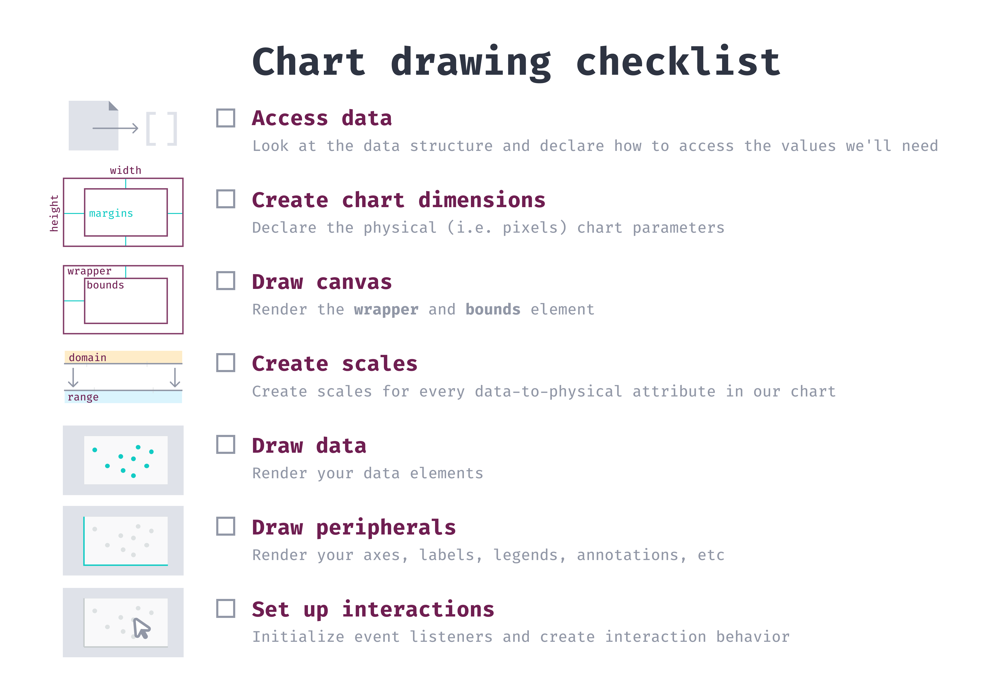
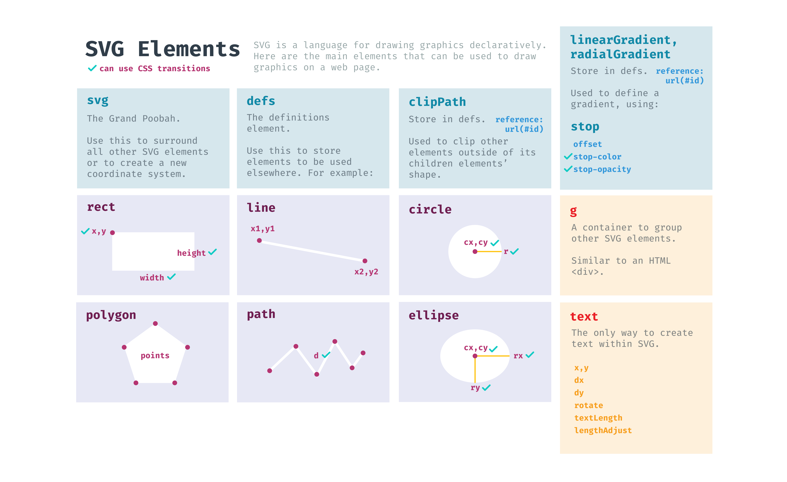
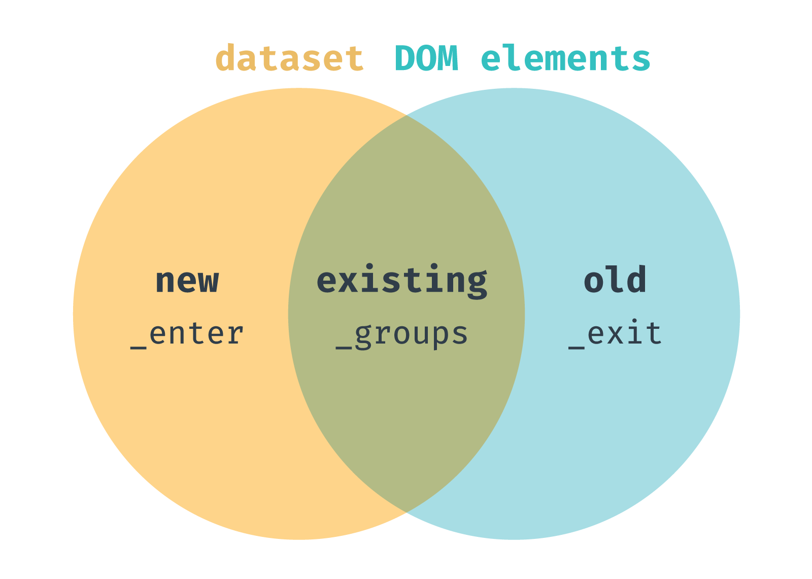
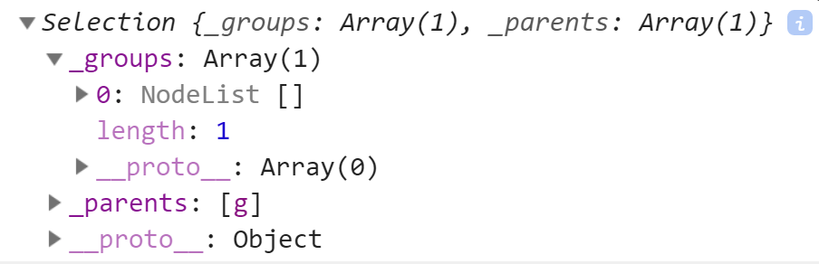
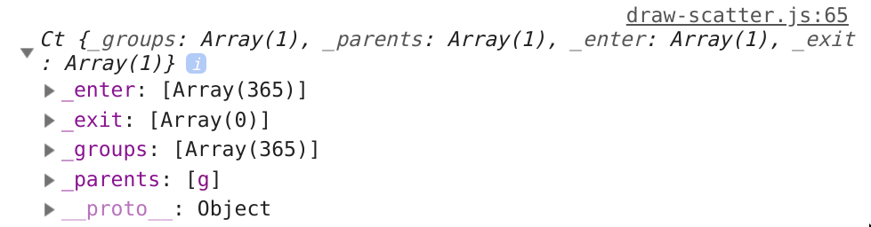
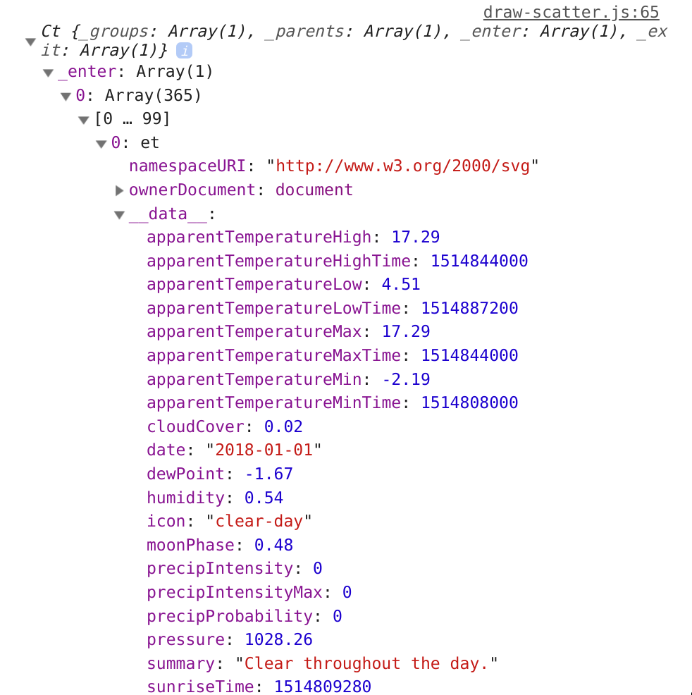
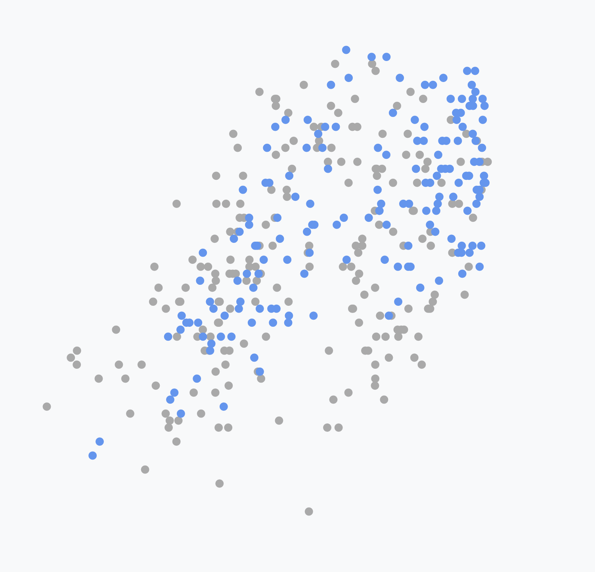

# 모든 d3 그래프의 기초



1. Access data (데이터 접근)

- Look at the data structure and declare how to access the values we'll need

2. Create chart dimensions (차트 크기 결정)

- Declare the physical (i.e. pixels) chart parameters

3. Draw canvas (그래프 영역 크기 결정)

- Render the chart area and bounds element

4. Create scales (스케일 결정 - 정의역 치역 범위)

- Create scales for every data-to-physical attribute in our chart

5. Draw data (데이터 그리기)

- Render your data elements

6. Draw peripherals (축, 범례, 라벨 등 그리기)

- Render your axes, labels, and legends

7. Set up interactions (상호작용 추가)

- Initialize event listeners and create interaction behavior

## d3.min

```js
const width = d3.min([window.innerWidth * 0.9, window.innerHeight * 0.9]);
```

> Math.min will count any `nulls` in the array as 0, whereas `d3.min will ignore them`
> Math.min will return `NaN` if there is a value in the array that is undefined or can't be converted into a number, whereas `d3.min will ignore it`
> d3.min will prevent the need to create another array of values if we need to use an accessor function
> Math.min will return Infinity if the dataset is empty, whereas `d3.min will return undefined`
> Math.min uses numeric order, whereas `d3.min uses natural order, which allows it to handle strings`.
> **Make sure to convert your values to numbers beforehand**

Math.min보다 이걸 쓰자.

## 차트 차원을 명시해야 하는 이유? (px 단위)

- SVG 요소는 고정 크기.

## Svg 스타일 적용 우선 순위

1번부터 우선해서 적용됨.  
2번과 3번 중 아무거나 써도 되지만 스타일은 CSS에 적용하는게 좋을 수 있음.

1. inline styles
2. CSS style sheets
3. attributes

## 산포도 그리기

라인 차트는 모든 점을 포함하는 하나의 선 (추세)
산포도는 하나의 데이터 하나의 원 (관계)



### Data joins

아직 점이 없는데 selectAll?  
이미 그려질 점과 추가될 점을 의미.

```js
const dots = bounds.selectAll("circle");
// 데이터 추가를 통해 점을 그림.
const dots = bounds.selectAll("circle").data(data);
```



- `_enter` : 요소가 아직 렌더링되지 않은 데이터 포인트(추가대상)
- `_exit` : 렌더링되었으나, 데이터셋에 없음.(삭제대상)

```js
let dots = bounds.selectAll("circle");
console.log(dots);
```



```js
dots = dots.data(data);
console.log(dots);
```



enter의 `__data__` 프로퍼티를 보면 데이터가 들어온 것을 알 수 있음.
새로운 데이터셋이 추가되면 enter() 메소드를 통해 더해줌.
exit는 나중에 알아보자.
(exit나 enter 개념은 React와 같이 쓴다면 몰라도 됨.)

```js
// 항상 새로운 점만 더함.
function drawDots(data, color) {
  const dots = bounds.selectAll("circle").data(dataset);

  dots
    .enter()
    .append("circle")
    .attr("cx", (d) => xScale(xAccessor(d)))
    .attr("cy", (d) => yScale(yAccessor(d)))
    .attr("r", 5)
    .attr("fill", color);
}

drawDots(data.slice(0, 200), "darkgrey");
setTimeout(() => {
  drawDots(data, "cornflowerblue");
}, 1000);
```



이전에 있던 점도 업데이트하고 싶다면 `merge()` 메소드를 활용함.

```js
function drawDots(data, color) {
  const dots = bounds.selectAll("circle").data(data);

  dots
    .enter()
    .append("circle")
    .merge(dots)
    .attr("cx", (d) => xScale(xAccessor(d)))
    .attr("cy", (d) => yScale(yAccessor(d)))
    .attr("r", 5)
    .attr("fill", color);
}
```

### `.join()` 메서드

enter, append, merge, exit를 통합한 기능임.  
즉 버릴건 버리고 새로 들어온 데이터와 이전 데이터를 통합해서 그려줌.

```js
function drawDots(data, color) {
  const dots = bounds.selectAll("circle").data(data);

  dots
    .join("circle")
    .attr("cx", (d) => xScale(xAccessor(d)))
    .attr("cy", (d) => yScale(yAccessor(d)))
    .attr("r", 5)
    .attr("fill", color);
}
```

## 차트 축의 tick

[로직 코드 보기](https://github.com/d3/d3-array/blob/master/src/ticks.js#L44-L52)  
[틱 갯수 설정하는 여러 방법들](https://github.com/d3/d3-axis#axis_ticks)
